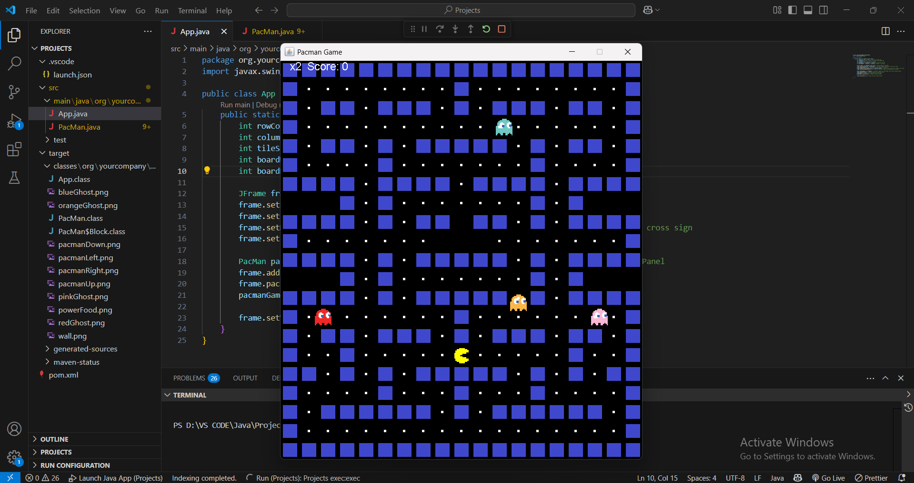

# Pacman-Game-using-Java

A classic Pac-Man clone built with Java Swing, faithfully recreating the arcade experience.




## 📋 Overview
This project implements the fundamental mechanics of Pac-Man: navigating a maze, collecting all pellets, and avoiding ghosts. Built solely in Java using the Swing toolkit, it demonstrates:

- **Core Game Loop**: A fixed-timestep loop for consistent frame rate.
- **Tile-based Rendering**: Maze rendering using a 2D int array to define walls and pellets.
- **Entity Management**: Separate classes for Pac-Man and Ghosts, each handling movement, animation, and collision logic.


## ⭐ Features

1. **Smooth Movement & Animation**
   - Four-directional movement for Pac-Man and ghosts with sprite animations (`pacmanUp.png`, etc.).
2. **Ghost Behavior**
   - Randomised direction at intersections to simulate unpredictable chase behaviour.
   - Collision detection that resets Pac-Man’s position and decrements life.
3. **Scoring System**
   - **Pellets**: +10 points each.
4. **Lives & Game Over**
   - Player starts with 3 lives; lose one upon collision with a non‐frightened ghost.
   - Display “Game Over” and allow restart via any key.
5. **Level Completion & Reset**
   - Automatically reloads map when all pellets are consumed, preserving total score and lives.


## 🛠️ Technologies & Tools

- **Language**: Java 8+
- **GUI**: Java Swing (`JFrame`, `JPanel`, `Graphics2D`)
- **Build**: Plain `javac` / IDE (Eclipse, IntelliJ, VS Code) or Maven (as an option)


## 🔧 Prerequisites

- **JDK 8+** installed and `JAVA_HOME` configured.
- (Optional) **Maven 3+** if you prefer to manage dependencies and generate a JAR.


## 🏗️ Build & Run
This section covers prerequisites, building the project, and running the game.
### Prerequisites
- **JDK 8+** installed and `JAVA_HOME` configured.
- (Optional) **Maven 3+** for dependency management and JAR packaging.
### Building
- **Without Maven** (command line):
 ```bash
 javac -d out src/main/java/org/yourcompany/yourproject/*.java
 ```
- **With Maven**:
 ```bash
 mvn clean package
 ```
### Running
- **From IDE**: Run the `App` class in `src/main/java/org/yourcompany/yourproject`.
- **Command Line**:
 ```bash
 # Without Maven:
 java -cp out org.yourcompany.yourproject.App
 # With Maven:
 java -jar target/pacman-java-1.0.jar
 ```
## 🎮 Controls
- **Arrow Keys**: Move Pac-Man (Up, Down, Left, Right).
- **Enter or Any Key** (after Game Over): Restart game.

## 🧠 Code Highlights
- **App.java**: Initializes the JFrame, sets size to match maze dimensions, and starts the game
panel.
- **PacMan.java**: Implements `Runnable`, handling:
 - **`run()`**: The game loop for rendering and updates.
 - **`draw(Graphics2D g)`**: Renders walls, pellets, Pac-Man, and ghosts.
 - **Movement Logic**: Queues next direction on key press, prevents reversal on walls.
 - **Collision Checks**: Pellets vs. Pac-Man tile, ghost collisions.
- **Assets**: Stored in `resources/`, loaded via `ImageIO.read()` for each sprite.

## 🔄 Possible Enhancements
- **Multiple Levels**: Load different maze layouts and increase difficulty.
- **Sound Effects**: Add Waka-Waka, ghost defeat, and death sounds via `javax.sound`.
